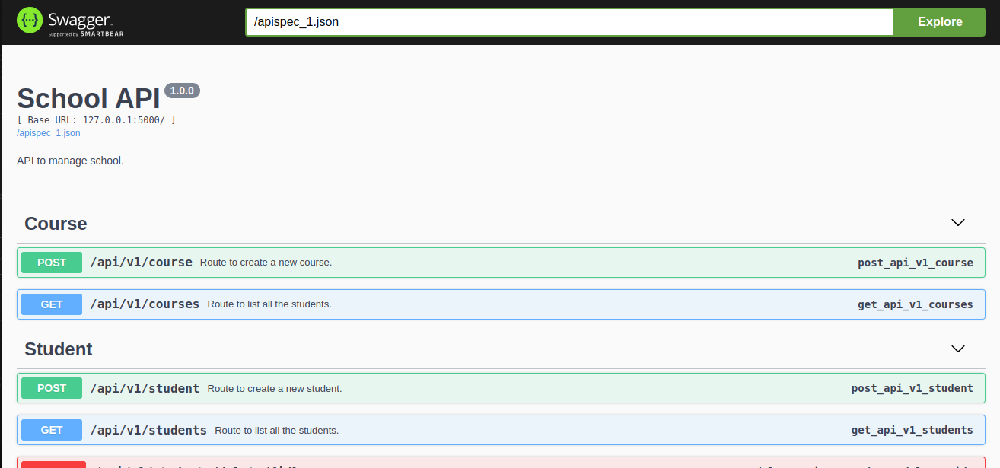
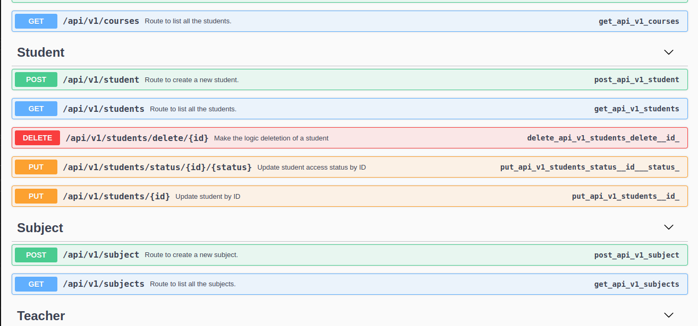
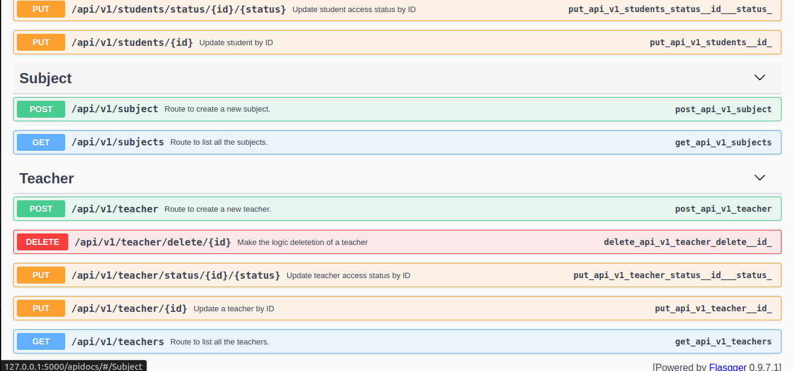

<h1 align="center">School API</h1>

<h1>Main used technologies</h1>

<ul>
<li>Python 3</li>
<li>Flask</li>
<li>Psycopg2</li>
<li>Flasgger</li>
</ul>

Swagger Images:

To run the project follow these steps:

<ol>
<li>Clone the project:</li>

git clone <a>https://github.com/soymattheus/School-API.git</a>

<li>Enter the cloned project folder</li>

<li>Create the virtual environment:</li>

virtualenv venv -p $(which python3)

<li>Activate the virtual environment:</li>

source venv bin/activate

<li>Install the dependencies:</li>

pip install requirements.txt

</ol>

I hope you like this little project.

If you have any difficulties, you can send me a message via <a href="https://www.linkedin.com/in/mattheusdev/">linkedIn</a>.

If you have ideas, contributions or would like to give any constructive criticism, feel free to message me via <a href="https://www.linkedin.com/in/mattheusdev/">linkedIn</a>. Any contribution will be welcome.
